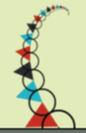
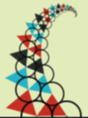

Doyle Spirals
===

[Origin](https://codepen.io/tmrDevelops/pen/eEWYPe)

`q` is number of arms.
`q` is 24.

Drawing one arm.

Original resource may be found here. <https://bl.ocks.org/robinhouston/6096562>

Try drawing circle.

Two arms.