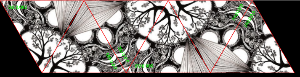
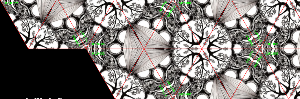

Symmetric Harmony
===

[Origin](https://codepen.io/tmrDevelops/pen/GvjMwg)


With original image, create kaleido style.

Load a image, draw it in single canvas.

Create `CanvasPattern` from selected image using `createPattern`.

Try to display `fillStyle` by fill rect whole screen.

``` typescript
        ctx.fillStyle = this.fillStyle;
        ctx.fillRect(0, 0, this.canvas.width, this.canvas.height);
```


Create stock image with 6 traiangles.



Repeat draw stock image to fill screen.



Draw a triangle and adjust draw position and rotation then fill with `fillStyle`.

Draw 6 triangles and repeat it.