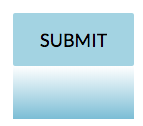
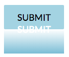
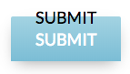

Button Hover Effect With `lettering.js` and `gsap`
===

[출처](https://codepen.io/hexagoncircle/pen/vJNMrB)

Using [lettering.js](https://github.com/davatron5000/Lettering.js) which seperate text content into seperated tags by letters, workds, lines.

Basically, all buttons has `::before` element which draws gradients.

And the `::before` element is hidden with `<button>`'s `overflow: hidden`.

Same way, inner text is hidden.

On hovering button, it displays lower text with animation.

Using [staggerTo](https://greensock.com/docs/TimelineMax/staggerTo), add character wise staggering animation effect.
