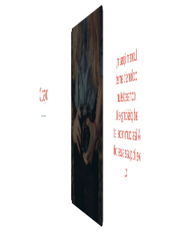

Parallax Flipping Cards
===

[출처](https://codepen.io/tyrellrummage/pen/wqGgLO)

Y axis rotation. Two sided flipping. But the text in each side are placed little bit higher than the face.




To take a screen shot, set font color to `salmon` and apply degrees to front: -45 back: 135, front: -80 back: 100.

`.inner` element has scale factor to prevent blurry rendering due to magnification by `translateZ`.

`.back, .front` has `transform-style: preserve-3d;` without it, text is stick to the face.

`.container` also has `transform-style: preserve-3d;` for flipping.

`.front:after` has `backface-visibility: hidden;` but seems no effect.

``` css
.front:after {
    position: absolute;
    top: 0;
    left: 0;
    z-index: 1;
    width: 100%;
    height: 100%;
    content: '';
    display: block;
    opacity: .6;
    background-color: #000;
    -webkit-backface-visibility: hidden;
    backface-visibility: hidden;
    border-radius: 10px;
}
```
