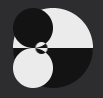

CSS: Yin Yang
===

[출처](https://codepen.io/mikehobizal/pen/vJeRxZ)



With background & border, draws half white, half black circle.

``` css
.circle {
    width: 80px;
    height: 40px;
    background: #eee;
    border-color: #111;
    border-style: solid;
    border-width: 0 0 40px 0;
    border-radius: 100%;
    position: relative;
}
```

Over the half white & half black circle, draws black & white circle for waving.

Moving circle with `mix-blend-mode: exclusion`.
