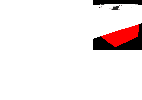
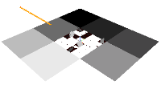
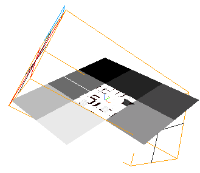
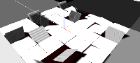

Fliping Pannel With Three.js And TweeMax
===

[Origin](https://codepen.io/noeldelgado/pen/QwWRwg)



It draws large bottom box under the main floor. I intentionally paint red color on it.
Seems to display black depth when pannel is flipping.


Floor consists of 8 parts of [`PlaneBufferGeometry`](https://threejs.org/docs/api/geometries/PlaneBufferGeometry.html)

Unfotunatly, shadow was not properly rendered. By setting next code, I could see the light guide lines.

``` js
    parent.add(light);
    parent.add(new THREE.CameraHelper(light.shadow.camera));
```



Yellow guide lines couldn't reach the target to make shadow, the tiles.
[DirectionalLightShadow](https://threejs.org/docs/#api/lights/shadows/DirectionalLightShadow) uses [OrthographicCamera](https://threejs.org/docs/#api/cameras/OrthographicCamera).
By adjusting `far` and `zoom`, shadow apeared as expected.

``` js
    light.shadow.camera['far'] = 2000;
    light.shadow.camera['zoom'] = 0.01;
```


