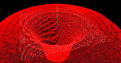

Wormhole With TweenMax
===

[Origin](https://codepen.io/Mamboleoo/pen/brdoeM)

Make workhole by changing vertex values with TweenMax animation output.

Change y value with 2 method.

First, update y to minus depends on distance of center but it recovers from half of the distance

Second, update y by sin result with distance.