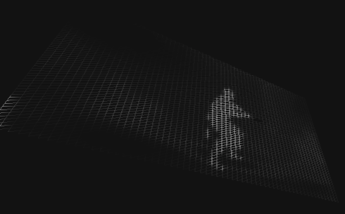

Video Texture
===

[Origin](https://codepen.io/gbnikolov/pen/OjEaRq)

Canvas can draw video frame with `drawImage` API.

`THREE.Texture` can be created from `HTMLCanvasElement`.

Due to `PlaneBufferGeometry` it just renders lines.

Vertext shader took pixcel from texture and get grey value and apply it to z position.

Fragment shader just dramw the grey value.
