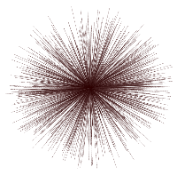
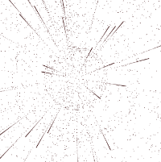
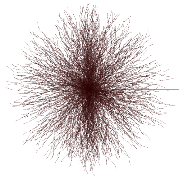

Wavy ball
===

[Origin](https://codepen.io/Mamboleoo/pen/RZRWGK)

`PointsMaterial` Using above dot texture with transparent.

Draw lines with `Points` mesh.
Take length 250 ~ 350.
Add vertex to length/0.5.
After set linear position of points of a line, rotate to random angle.

Every frame update y position with `sin` wave.