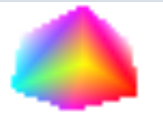
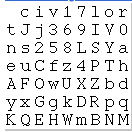

title
===

[Origin](https://codepen.io/mutoo/pen/YxGJOb?editors=0010)

Has 2 program one for **cube**, one for **canvas**.

First to render **cube** to framebuffer


**Canvas** has 2 texture.

Using next texture for font as **texture 0**.


Using frame buffer texture for font face color as **texture 1**.

Find texture pixcel from cube rendered frame buffer.

``` glsl
        vec4 pixel = texture2D(u_tex, v_texcoord);
```

Map brightness to ascii character

``` glsl
        float brightness = float(pixel.r) * 0.2 + float(pixel.g) * 0.7 + float(pixel.b) * 0.1;
        float index = (1.0 - brightness) * 63.0;
```

Show pixcel according to font texture.

``` glsl
        float x = float(col) * 14.0 + mod(gl_FragCoord.x, 14.0);
        float y = 2.0 + float(6 - row) * 18.0 + mod(gl_FragCoord.y, 18.0);
        vec4 pif = texture2D(u_fontmap, vec2(x, y) / 128.0);
        if (pif.r > 0.5)
            discard;
```
