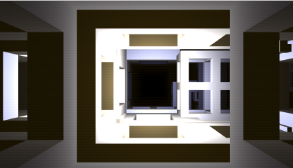
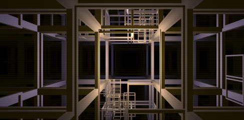
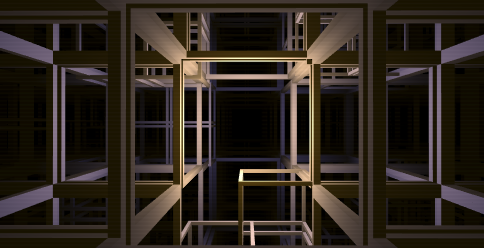
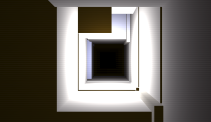
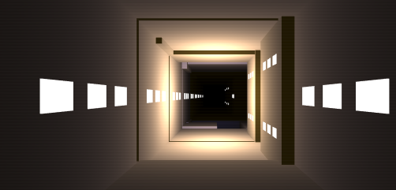
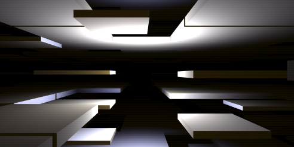
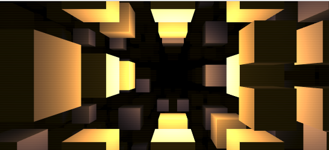

Deep Structure: Infinite Scrolling
===

[Origin](https://codepen.io/ge1doot/pen/brqZNX)

`Block` uses own transform matrix for its location.

635 Blocks created and each z postion added with speed value per each frame.

`fractalCube` is key function to create blocks.
`fractalCube` call recursively until density level reached.
Sub calls has below 1/4 size

## Block Type 0

## Block Type 1

Depth 4

Depth 1

## Block Type 2

## Block Type 3

## Block Type 4

## BLock Type 5

## BLock Type 6